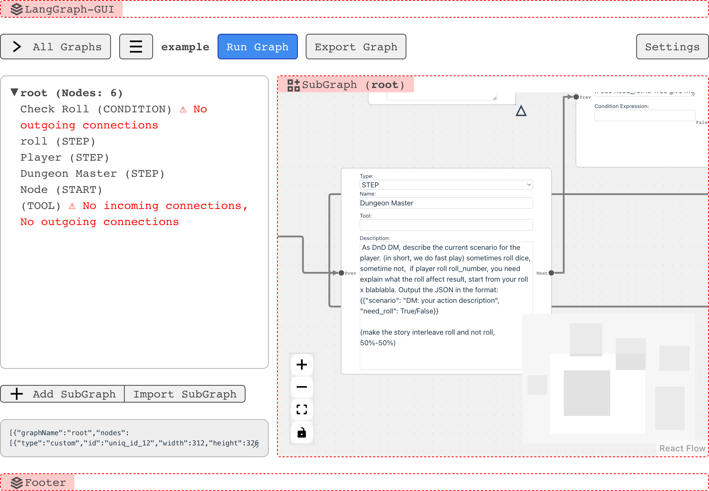

# reactflow-ts



## Dev 
* compile
  * ```npm run tsc```
* lint
  * ```npm run lint```
* hold
  * ```npm run dev```
* vitest
  * ```npm run test```

## Serve
``` bash
RUN npm run build
run npm preview
```